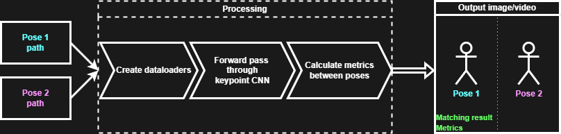

# <b>Pose similarity comparison using deep learning</b>
This application helps to compare the similarity of poses of two different people in photos or videos

  
<b>Example</b> (clickable spoiler)

  
  * Image  
    
  
  * Video  
    
  

## <b>Usage</b>
* **CMD/Bash**

  Call main script via terminal `$ python main.py`, fill neccesary field and wait for output
* **As python class**

  Create instance of `VirtualCoach` from `./src/coach.py`, call function `.compare_poses`  
  [<b>Notebook with example</b>](usage_example.ipynb)

## <b>Metrics</b>
### <i>OKS (Object keypoint similarity)</i> (main metric)

$$OKS = \frac{\sum_{i \in [0, N-1]}\exp(\frac{-d_i^2}{2s^2k_i^2}) \delta(v_i > 0)}{\sum{i \in [0, N-1]}\delta(v_i > 0)} \text{, where}$$

* $s$ - object scale  
* $d_i$ - distance of predicted joint $i$ from reference  
* $k_i$ - per-keypoint constant that controls fall off  
* $v_i$ - visibility flag  
* $\delta(v_i > 0)$ - delta function. Compute *OKS* only if keypoint is visible
  
### <i>RMSE (Root mean squared error)</i>

$$RMSE = \sqrt{\sum_{i=1}^N \frac{(\hat{y}_i - y_i)^2}{N}} \text{, where}$$

* $y$ - reference pose  
* $\hat{y}$ - actual pose  

### <i>WD (Weighted distance)</i>

$$WD = \sum_{i=1}^N{\frac{\frac{1}{\sum{w_{ref}^i}} \times \sum{w_{ref}^i||y_i - \hat{y}_i||}}{N}} \text{, where}$$

* $w_{ref}$ - "weight" of reference keypoints (logits from model output)  
* $y$ - reference pose  
* $\hat{y}$ - actual pose  

### <i>CosSim (Cosine similarity)</i>

$$CosSim = \frac{y \cdot \hat{y}}{\parallel y \parallel \cdot\parallel \hat{y} \parallel} = \frac{\sum_{i=1}^N{y_i \hat{y}_i}}{\sqrt{\sum_{i=1}^N{y_i^2}} \sqrt{\sum_{i=1}^N{\hat{y}_i^2}}} \text{, where}$$

* $y$ - reference pose
* $\hat{y}$ - actual pose

## <b>Architecture</b>
Simple visualization of pipeline:  

## References
[<b>Object Keypoint Similarity in Keypoint Detection</b>](https://learnopencv.com/object-keypoint-similarity/)