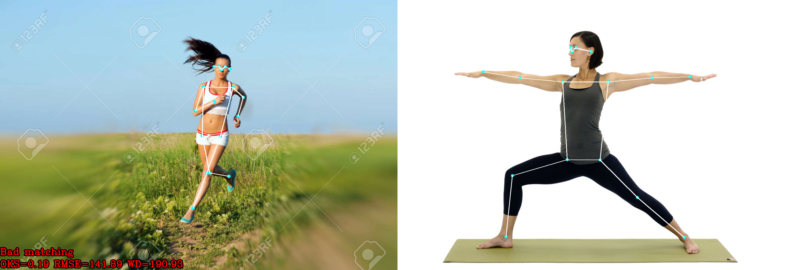

# Pose similarity comparison using deep learning
This application helps to compare the similarity of poses of two different people in photos or videos

  
<b><u>Example</b> (clickable spoiler)</u>

  
  * Image  
    
  
  * Video  
    
  

## Metrics
1. <b><i>OKS (Object keypoint similarity)</i></b>

    $$ OKS = \frac{\sum_{i \in [0, N-1]}\exp(\frac{-d_i^2}{2s^2k_i^2}) \delta(v_i > 0)}{\sum{i \in [0, N-1]}\delta(v_i > 0)} \text{, where} $$

    $s$ - object scale  
    $d_i$ - distance of predicted joint $i$ from reference  
    $k_i$ - per-keypoint constant that controls fall off  
    $v_i$ - visibility flag  
    $\delta(v_i > 0)$ - delta function. Compute *OKS* only if keypoint is visible
  
2. <b><i>RMSE (Root mean squared error)</i></b>

    $$ RMSE = \sqrt{\sum_{i=1}^N \frac{(\hat{y}_i - y_i)^2}{N}} \text{, where} $$

    $y$ - reference pose  
    $\hat{y}$ - actual pose  

3. <b><i>WD (Weighted distance)</i></b>

    $$ WD = \sum_{i=1}^N{\frac{\frac{1}{\sum{w_{ref}}} \times \sum{w_{ref}||y - \hat{y}||}}{N}} \text{, where} $$
    
    $w_{ref}$ - "weight" of reference keypoints (logits from model output)  
    $y$ - reference pose  
    $\hat{y}$ - actual pose  

## Usage
* **CMD/Bash**

  Call main script via terminal `$ python main.py`, fill neccesary field and wait for output
* **As python class**

  Create instance of `VirtualCoach` from `./src/coach.py`, call function `.compare_poses`  
  [<b>Notebook with example</b>](./examples/usage_example.ipynb)

## Architecture
Simple visualization of pipeline:  
